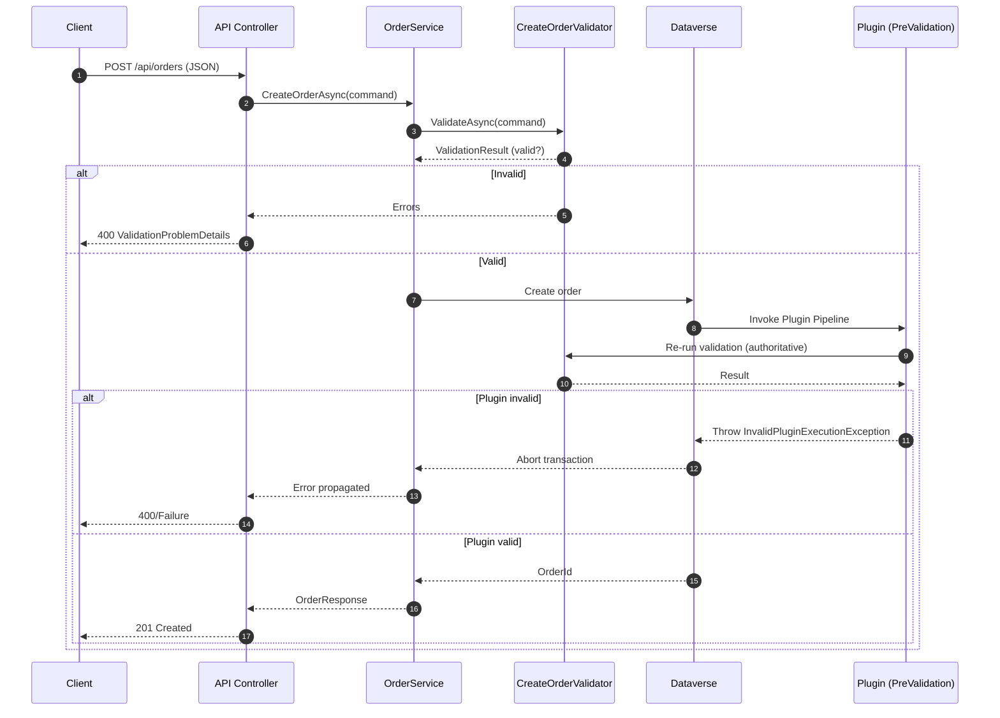
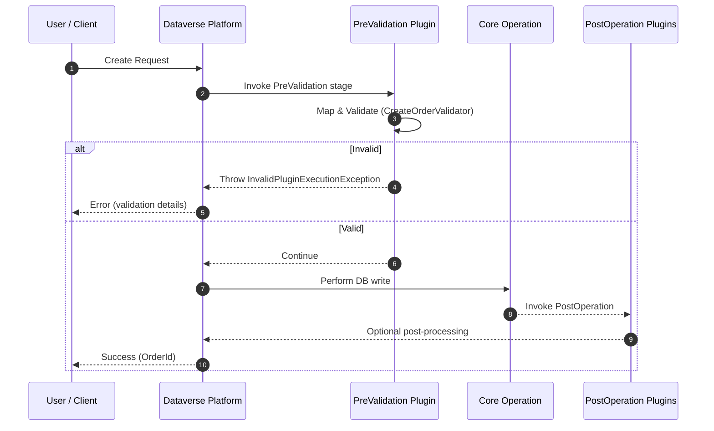

# Validation Flow: Dataverse Plugin vs .NET API

This document explains exactly **where** and **how** the shared `CreateOrderValidator` is invoked in both the Dataverse plugin pipeline and the ASP.NET Core API, illustrating the fail-fast plus server-authoritative validation strategy.

---
## 1. Shared Validator Overview

File: `src/Shared.Domain/CreateOrderValidator.cs`

The validator encapsulates all business rules for creating an order (customer existence & status, order date bounds, unique order number, line product checks, pricing rules, total consistency). It depends only on the abstraction `IOrderRulesData`, allowing any host (plugin or API) to supply its own data access implementation.

Key characteristics:

- No direct Dataverse or EF dependencies
- All async lookups funneled through `IOrderRulesData`
- Deterministic, side-effect free (pure validation logic)

```csharp
var validator = new CreateOrderValidator(rulesData);
var result = await validator.ValidateAsync(command, ct);
```

---

## 2. API Validation Flow (Fail-Fast)

Entry point: `OrdersController.CreateOrder` (`src/Api.Orders/Controllers/OrdersController.cs`)

High-level sequence:

```text
Client -> API Controller -> (Model Binding) -> Request DTO -> Command Mapping -> Service -> Validator -> Dataverse (create) -> Plugin (re-validates)
```

### Sequence Diagram



Controller excerpt (simplified):

```csharp
var command = request.ToCommand();
var response = await _orderService.CreateOrderAsync(command, cancellationToken); // internally runs validator
```

Service responsibility (conceptual):

```csharp
// Inside service
var validationResult = await _validator.ValidateAsync(command, ct);
if(!validationResult.IsValid) throw new ValidationException(validationResult.Errors);
```

Why fail-fast?

- Avoids unnecessary Dataverse round-trips on obviously invalid data
- Returns structured errors (`ValidationProblemDetails`) immediately
- Still allows the plugin to act as final authoritative gate (defense in depth)

---

## 3. Dataverse Plugin Validation Flow (Authoritative Enforcement)

Entry point: `CreateOrderPlugin.Execute` (`src/Plugins.Dataverse/Orders/CreateOrderPlugin.cs`)

Current plugin skeleton (abridged):

```csharp
var context = (IPluginExecutionContext)serviceProvider.GetService(typeof(IPluginExecutionContext))!;
var serviceFactory = (IOrganizationServiceFactory)serviceProvider.GetService(typeof(IOrganizationServiceFactory))!;
var tracing = (ITracingService)serviceProvider.GetService(typeof(ITracingService))!;
var orgService = serviceFactory.CreateOrganizationService(context.UserId);

// Guard conditions (message, entity, required fields)...
var command = EntityMapper.MapToCreateOrderCommand(targetEntity, tracing);

// Supply plugin-specific data adapter implementing IOrderRulesData
var rulesData = new DataverseOrderRulesData(orgService);
var validator = new CreateOrderValidator(rulesData);
var result = validator.Validate(command);
if(!result.IsValid)
    throw new InvalidPluginExecutionException(result.GetErrorsAsString());
```

Where it sits in the pipeline:



Plugin role:

- Executes inside Dataverse transaction scope
- Blocks invalid records even if API or other client skipped validation
- Ensures invariants are always enforced server-side

---

## 4. Adapter Abstraction Bridging Host Environments

Both hosts implement `IOrderRulesData` differently:

| Host | Adapter File | Data Source | Purpose |
|------|--------------|-------------|---------|
| API | `Api.Orders/Adapters/DataverseOrderRulesDataForApp.cs` | Dataverse ServiceClient | Remote lookup in fail-fast phase |
| Plugin | `Plugins.Dataverse/Adapters/DataverseOrderRulesData.cs` | `IOrganizationService` | In-process transactional validation |

Benefits:

- Each host optimizes data access (caching could be added independently)
- Validator remains agnostic to environment
- Easier unit testing by mocking `IOrderRulesData`

---

## 5. Error Propagation Differences

| Aspect | API | Plugin |
|--------|-----|--------|
| Exception Type | `FluentValidation.ValidationException` caught and converted to HTTP 400 | `InvalidPluginExecutionException` returned to Dataverse client |
| Error Format | `ValidationProblemDetails` (JSON) | Platform error dialog / flow failure message |
| Multiple Errors | Aggregated per property | Combined string (custom formatting helper) |
| Recovery | Client can correct fields immediately | User re-submits after fixing form data |

---

## 6. Defense in Depth Rationale

1. API performs fail-fast validation to reduce load and improve UX
2. Plugin guarantees invariants for any channel (forms, flows, integrations) bypassing the API
3. Shared validator ensures a single modification updates rules everywhere

---

## 7. Extending the Flow


When adding a new rule:
 
1. Add logic to `CreateOrderValidator`
2. Extend `IOrderRulesData` if new data is required
3. Implement new members in both adapters
4. Add/adjust unit tests in `Shared.Domain.Tests`
5. (Optional) Add an API integration test

Diagram of change propagation:
 
```text
Update Validator -> Compile -> Tests pass -> Deploy API + Deploy Plugin Assembly -> Rule active everywhere
```

---

## 8. Summary

The architecture centralizes rule intent while letting each runtime handle error transport and context-specific concerns. This keeps business logic DRY, testable, and consistently enforced.

---
*Last updated: autogenerated documentation.*
